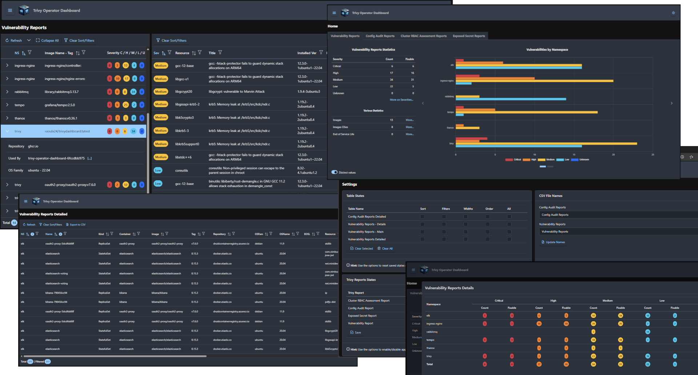
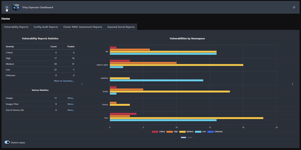

# Trivy Operator Dashboard

  

## Intro

Welcome to the Trivy Operator Dashboard, a comprehensive security management tool for Kubernetes environments. Built on
top of the powerful [Trivy Operator](https://github.com/aquasecurity/trivy-operator)
from [Aqua Security](https://www.aquasec.com), this dashboard provides insights into your cluster's security posture. It
offers detailed insights on vulnerability scans, policy validation scans and other ones. With an intuitive and
user-friendly interface, you can easily monitor, detect, and respond to security threats, ensuring your Kubernetes
environment remains robust and secure.

## Features

The application exposes the following reports:

- Vulnerability Reports
- Config Audit Reports
- Cluster RBAC Assessment Reports
- Exposed Secret Reports

All of them consist of dashboards (for view at a glance), browse and inspect findings (with table filters, sorts),
export data.

This app is fully operational, with new features currently in development.

## Why we did it. The Story Behind Trivy Operator Dashboard

A few months ago, at the start of summer, two friends convened on a terrace. One voiced concerns about the
labor-intensive process of manually parsing vulnerabilities. As they discussed the challenges, a pivotal question
arose: "Should we do it? Why not?" This moment marked the beginning of this journey to streamline and automate the
process. What we had in mind:

1. **Security is Imperative:** In our professional life, our dedication to security led us to create Trivy Operator
   Dashboard. We needed a comprehensive solution to monitor, manage, and mitigate risks that existing open-source
   options couldn't provide.

2. **Bridging the Open-Source Gap:** None of the available open-source dashboards met our specific needs. We developed
   Trivy Operator Dashboard to fill this gap, offering a powerful and versatile tool tailored to our requirements.

3. **DevOps Curiosity:** As a DevOps person, my curiosity drove me to start building Trivy Operator Dashboard. This
   project allowed me to gain a deeper and intimate understanding of the development process, enhancing my skills and
   sustaining continuous learning.

Trivy Operator Dashboard represents our commitment to security, bridging open-source gaps, and our relentless curiosity
as IT dev professionals. We are happy to share this journey with the community.

## Considerations

Our goal with Trivy Operator Dashboard is to ensure that it excels in a singular focus: being an effective and efficient
dashboard. We've had extensive internal discussions and, for the time being, we’ve decided not to include
enterprise-grade features such as authentication/authorization, Trivy Reports history, email alerts, on-demand external
image scan, or direct configuration of the Trivy operator.

While we recognize the potential value these features could bring, our current aim is to maintain simplicity and focus
on perfecting the core functionality of the dashboard. However, we remain open to the possibility of expanding its
capabilities if the app gains significant traction and user demand increases.

For now, our priority is to deliver the rest of the provided features by Trivy (such as ClusterComplianceReport,
ClusterConfigAuditReport, ClusterInfraAssessmentReport and so on), to have a robust and reliable dashboard that meets
immediate needs and serves the community effectively.

> **Important:** Given the sensitivity of the data being handled, we recommend implementing external authentication
> measures. Options include (and not limited to) basic authentication on ingress (not recommended, just as a last
> resort)
> or, preferably, using [oauth2-proxy container](https://quay.io/repository/oauth2-proxy/oauth2-proxy) (project
> on [GitHub](https://github.com/oauth2-proxy/oauth2-proxy)) for enhanced security.

## Documentation

[Installation](docs/install-doc.md)

[Main User Guide](docs/main-doc.md)

### Compatibility and Apps

Tested under:

| App name       | Version(s)              |
|----------------|-------------------------|
| Kubernetes     | 1.28 - 1.30; Linux; x64 |
| Trivy Operator | 0.22                    |
| Windows        | 10, 11; x64, arm64      |

Browsers: tested mainly using Edge. Also tested on Chrome, Firefox and Opera.

Recommended resolution: 1080p (1920x1080)
> **Note on resolution:** although we are safe to state that Trivy Operator Dashboard is a Business Application (that
> handles and displays extensive datasets) and that it should be used on desktop or laptop monitors, the app scales ok
> in
> both directions. On a phone the user experience may be less than optimal, but it is usable. On larger display, as some
> might say, "the bigger, the better".

### Known bugs

- When a Dropdown Filter (such as Namespaces or Severities) gets cleared by its Clear button or by table's Clear
  Sort/Filters, the table displays unfiltered data, but the Filter still acts like is Filtering. It is a well-known bug
  from Primeng.

## For Community - More Info

[Development Notes](DEV_NOTES.md)

[Contributing](CONTRIBUTING.md)

[Code of Conduct](CODE_OF_CONDUCT.md)

[Release Notes](RELEASE_NOTES.md)

## Acknowledgements

**Personal:** I would like to give my sincere thanks to the following persons who have helped me to get here:

- **Dănuț** - For his technical guidance and explanations.
- **Florin** - For his insights regarding the app and endurance with its bugs.
- **Alina** - My better half, for tolerating my long programming evenings.

**A big nod:** We extend our heartfelt gratitude to Aqua Security for the Trivy and Trivy Operator. These outstanding
tools have been instrumental in enhancing the security management processes for many, and we deeply appreciate their
openness and contribution to the open source community.

And last but not least, a big thank you to all the contributors and users who continuously support and improve these
tools.
